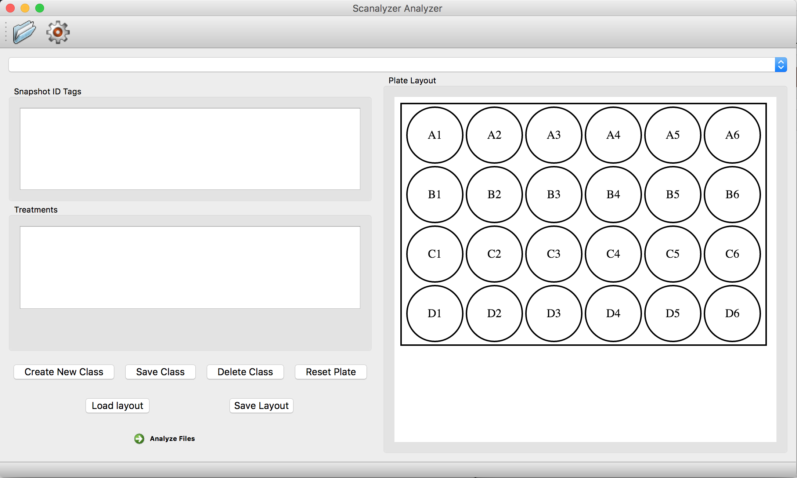

# Scanalyzer Analyzer #

The Scanalyzer Analyzer is an application intended for use with a Lemnatec Scanalyzer. Its purpose is to allow a user to read in csv files produced from experiments on the Scanalyzer and run analysis on them, producing an Exel file with tables and graphs in a standardized format.

**Figure 1.** Basic user interface of Scanalyzer Analyzer.

### Purpose ###

The impetus for this project was the time input required to process output from the Lemnatec Scanalyzer by hand, which could take several hours per experiment. The Scanalyzer Analyzer allows users to quickly load any number of experiment files (.csv's from the Scanalyzer), apply experimental designs (we call them plate layouts), and produce analysis for each file. The output of this process is an xlsx file corresponding to each input csv. 
