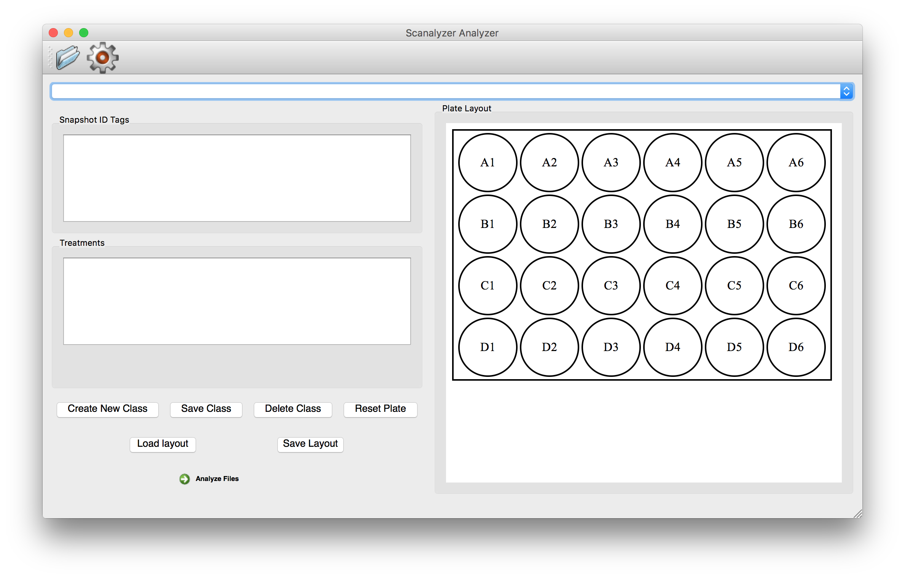
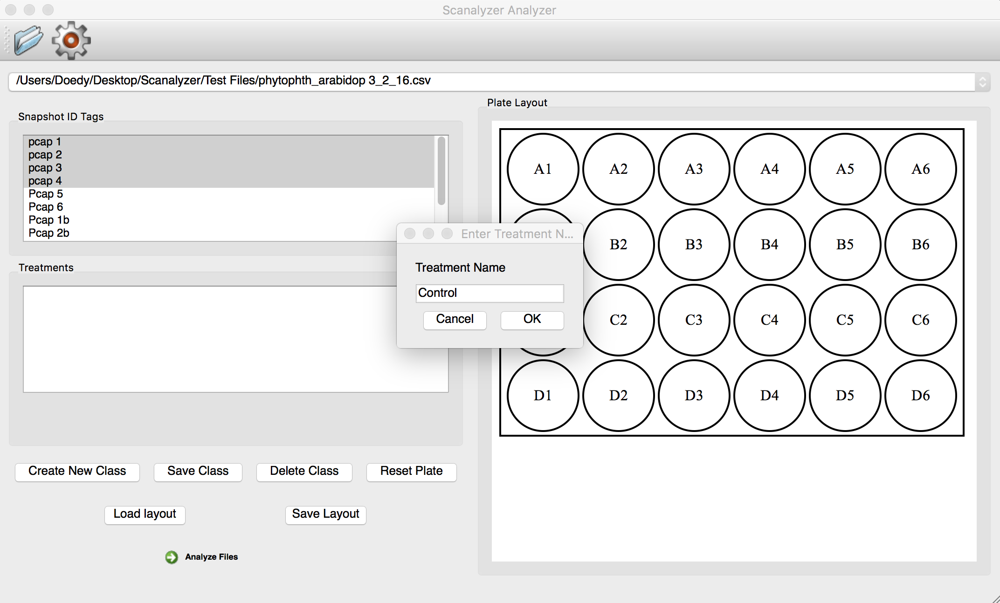
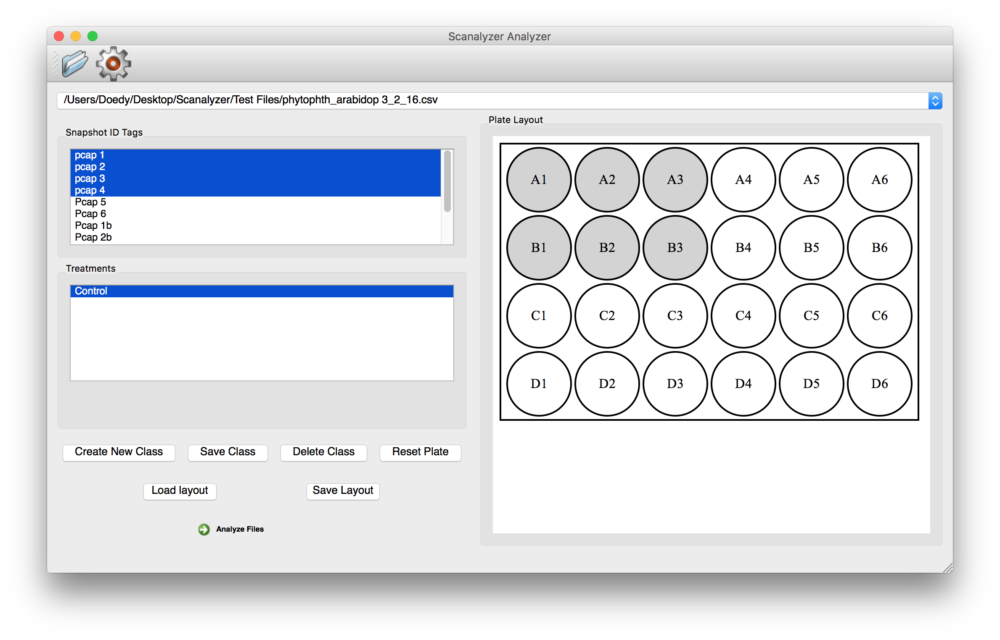

# Scanalyzer Analyzer #

The Scanalyzer Analyzer is an application intended for use with a Lemnatec Scanalyzer. Its purpose is to allow a user to read in csv files produced from experiments on the Scanalyzer and run analysis on them, producing an Exel file with tables and graphs in a standardized format.

**Figure 1.** Basic user interface of Scanalyzer Analyzer.

### Purpose ###

The impetus for this project was the time input required to process output from the Lemnatec Scanalyzer by hand, which could take several hours per experiment. The Scanalyzer Analyzer allows users to quickly load any number of experiment files (.csv's from the Scanalyzer), apply experimental designs (we call them plate layouts), and produce analysis for each file. The output of this process is an xlsx file corresponding to each input csv. This file contains sheets for the tabulated raw data, analyzed data, and graphs.

### Operation ###

#### Importing Files ####
Users should use the Folder icon in the top left corner to select file(s) for import. Once the file(s) is imported its name will appear in the drop down menu just below the icons. This menu can be used to select the desired file when working with multiple files. Once a file is selected the names of the plates read by the Scanalyzer Analyzer will appear in the Snapshot ID Tags box.

#### Defining Plate Layouts ####
Plate layouts can be defined, saved, and loaded using the buttons below the Treatments box. We will cover the function of each of these buttons. Before a treatment can be defined, a plate must first be selected from the Snapshot ID Tags box. These can be selected one or multiple at a time.

##### Creating a Clas #####
Once selected a user can click the Create New Class button to add a new class to the plate. For example, a plate may contain the following classes; Positive Control, Negative Control, Treatment1, Treatment2. After clicking the Create New Class button a popup menu will appear prompting the user for the name of the class. Entering the name and clicking OK will add the treatment to the selected plates.

**Figure 2.** Adding a treatment to plates.

##### Selecting Wells for Class #####
Once a class has been defined it will be added to the Treatments box and automatically selected. At this point the class has not been saved and clicking on a different Snapshot ID Tag or class will remove it from the current plate. In order to save the Class, first select the wells in which the class was present by clicking and dragging over the plate in the Plate Layout view. This plate can be changed by using the Gear icon at the top of the window and defaults to a 24 Well Plate. After highlighting the desired wells, click Save Class.

**Figure 3.** Selecting wells for a treatment class.
